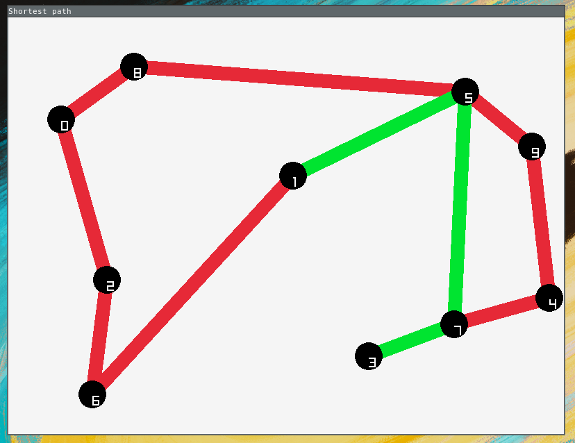
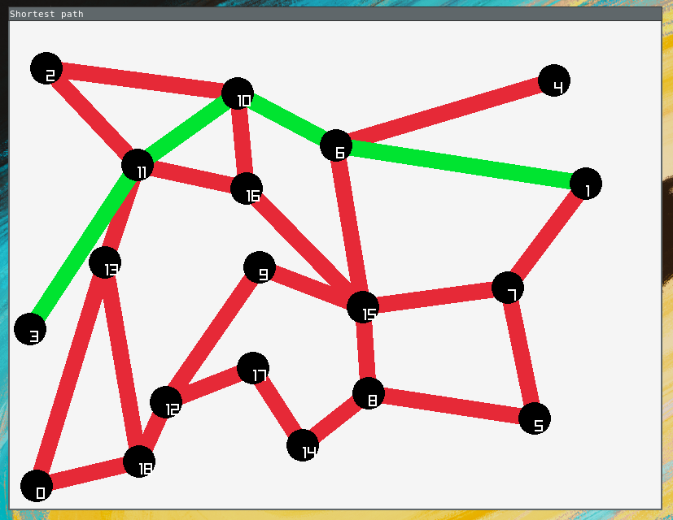

[Dijkstra's algorithm](https://en.wikipedia.org/wiki/Dijkstra%27s_algorithm) visualizer

This program allows the user to create their own graph and pass two params (origin vertex and destination vertex) for the algorithm to search for the shortest path between them.

## Building and running
To build this software you'll need the graphics library `raylib` installed in your computer. Then, inside of the project folder run:

``` console
$ make
```

and then:

``` console
$ ./spv [ORIG_VERT] [DEST_VERT]
```

## Keybinds
| Action        | Keybind       |
|---------------|---------------|
| Create vertex | `Right click` |
| Link vertexes | `Left click`  |
| Reset         | `R`           |
| Quit          | `ESC`         |

## Demos


